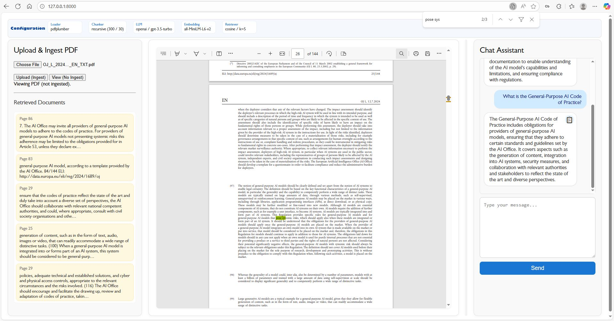

RAG Service Lab
================

Screenshot
----------


Use case
--------
RAG Service Lab is a small example project that demonstrates a Retrieval-Augmented Generation (RAG) workflow.  It shows how to:

- Upload and view PDF documents in the browser.
- Ingest PDF content into a vector store (embeddings) for retrieval.
- Query a backend chat endpoint that uses retrieved document chunks to produce context-aware answers.

This repo is intended as a lightweight lab/demo to experiment with ingestion, retrieval, and a minimal chat UI.

Quickstart (PowerShell)
------------------------
1. From the `examples/rag-service-lab` folder set `PYTHONPATH` so the app can import from `src` and then start `uvicorn`:

```powershell
$env:PYTHONPATH = ".\src"; uvicorn main:app
```

2. Open the UI in your browser. If the FastAPI app serves static files, visit `http://127.0.0.1:8000`.
	If not, open the file `examples/rag-service-lab/static/index.html` directly in your browser and point the page at the API host (change fetch URLs in the HTML if necessary).

Notes: to enable automatic reload while developing, you can run:

```powershell
$env:PYTHONPATH = ".\src"; uvicorn main:app --reload
```

What the UI does
---------------
- Upload (Ingest): sends a PDF file to `POST /ingest` (server stores vectors and metadata).
- View (No Ingest): opens the selected PDF locally inside the embedded viewer without sending it to the server.
- Chat: sends messages to `POST /chat` and displays responses; when available, the response includes retrieved document chunks shown under "Retrieved Documents".
- Configuration header: a compact row of small boxes showing the active loader, chunker, LLM, embedding and retriever parameters fetched from `GET /config`.
- Resizable layout: drag the vertical splitter between the PDF viewer and chat to adjust widths.

Pipeline: Upload → Ingest → Query
----------------------------------
This section explains the end-to-end flow the demo implements and shows the commands you can use to reproduce it manually.

1. Upload (POST /ingest)
	- Client uploads a PDF using `multipart/form-data` (field name `file`).
	- Server extracts text from the PDF (configured extractor, e.g., `pdfplumber`).

	PowerShell example:
	```powershell
	$file = Get-Item .\mydoc.pdf
	Invoke-RestMethod -Method Post -Uri 'http://127.0.0.1:8000/ingest' -Form @{ file = $file }
	```

	curl example:
	```bash
	curl -X POST "http://127.0.0.1:8000/ingest" -F "file=@mydoc.pdf"
	```

2. Chunking & Embeddings
	- The server splits extracted text into chunks according to chunker settings (size, overlap, separators).
	- Each chunk is converted to an embedding vector and saved (with metadata) into the configured vectorstore (e.g., FAISS).

3. Query / Retrieval (POST /chat)
	- Client sends a natural-language question to `POST /chat`.
	- Server retrieves the most relevant chunks from the vectorstore (top_k), assembles them into the prompt context, and calls the configured LLM.
	- The endpoint returns the model's answer and the `retrieved_docs` list (each entry contains `page_content`, `page`, and `file_path`).

	PowerShell example (read full JSON response):
	```powershell
	$body = '{"message":"What obligations does the AI Act place on providers?"}'
	$resp = Invoke-RestMethod -Method Post -Uri 'http://127.0.0.1:8000/chat' -Headers @{ 'Content-Type'='application/json' } -Body $body
	$resp | ConvertTo-Json -Depth 6
	```

	curl example:
	```bash
	curl -s -X POST "http://127.0.0.1:8000/chat" -H "Content-Type: application/json" -d '{"message":"What obligations does the AI Act place on providers?"}'
	```

4. Post-processing & review
	- The UI shows the assistant text and the retrieved-doc bubbles; click a bubble to inspect the chunk or use the separate PDF viewer to read the source page.
	- For auditability, log retrievals (which chunks were returned, with scores and page numbers) and store them alongside queries.

Legal-department use case (example)
----------------------------------
- Objective: quickly find authoritative excerpts of the AI Act to support legal analysis and citations.
- Workflow: ingest the official AI Act PDF once to build a persistent vector index; legal analysts ask questions in plain language and receive:
  - a contextualized answer from the LLM, and
  - the retrieved document chunks with page numbers and file path for direct citation.
- Benefits: fast access to exact snippets, repeatable searches, and the ability to tune chunking/overlap to improve citation precision.

Good practices for legal usage:
- Keep the vectorstore and source PDFs under controlled access and version the index for reproducibility.
- Increase `top_k` or chunk overlap for higher traceability when precise citations are required.
- Integrate `pdf.js` to let reviewers jump from a retrieved chunk to the exact page and highlighted text in the PDF viewer.
- Log retrievals and model responses for auditing and compliance reviews.

API (example endpoints)
-----------------------
- `POST /ingest` — multipart form upload, field `file` (PDF). Ingests document, performs extraction/chunking, and stores embeddings.
- `POST /chat` — JSON body `{ "message": "..." }`. Returns a model response plus `retrieved_docs` (array of chunks with `page`, `page_content`, `score`, ...).
- `GET /config` — returns the runtime configuration (extraction, chunking, llm, embeddings, retrieval) used to render the compact header.

File layout (important)
----------------------
- `static/index.html` — single-page UI for uploading, viewing, chatting, and inspecting retrieved chunks.
- `src/` — server source code (FastAPI app and ingestion/retrieval logic).
- `main:app` — server entrypoint used by uvicorn in the examples folder.

- `src/llm_utils` and `src/rag` — shared modules used by the examples and server logic.  Set `PYTHONPATH` to the repository root (or `examples/rag-service-lab/src`) so these packages can be imported by the example app. `llm_utils` contains helper functions for LLM calls and prompt handling; `rag` contains ingestion, chunking, embedding and retrieval pipeline code.

Developer notes
---------------
- Viewing a PDF with "View (No Ingest)" is strictly client-side and does not send data to the server.
- After ingesting, the UI no longer auto-opens the document — use the View action to inspect PDFs.
- Retrieved document highlights are placeholders; integrating `pdf.js` will allow precise in-page highlighting and jumping to text fragments.
- The vector store location and embedding backend are configured in the server code — check `src` for details.

Troubleshooting
---------------
- If `/config`, `/chat`, or `/ingest` fail with network/CORS errors, ensure the FastAPI server is running and that CORS is enabled if serving the UI from a different origin.
- If the UI cannot find static files, either serve `static/` from the FastAPI app or open `static/index.html` directly in the browser and update the API host if needed.

Next steps & suggestions
------------------------
- Persist the UI splitter width in `localStorage` so the layout is preserved across reloads.
- Add PDF.js integration to enable text highlighting and navigation to retrieved snippets.
- Add example curl or Python scripts to demonstrate end-to-end ingest → query flows.

License & Attribution
---------------------
This example is provided as-is for experimentation and educational purposes. Check upstream project licenses for third-party components used in the `src` code.


