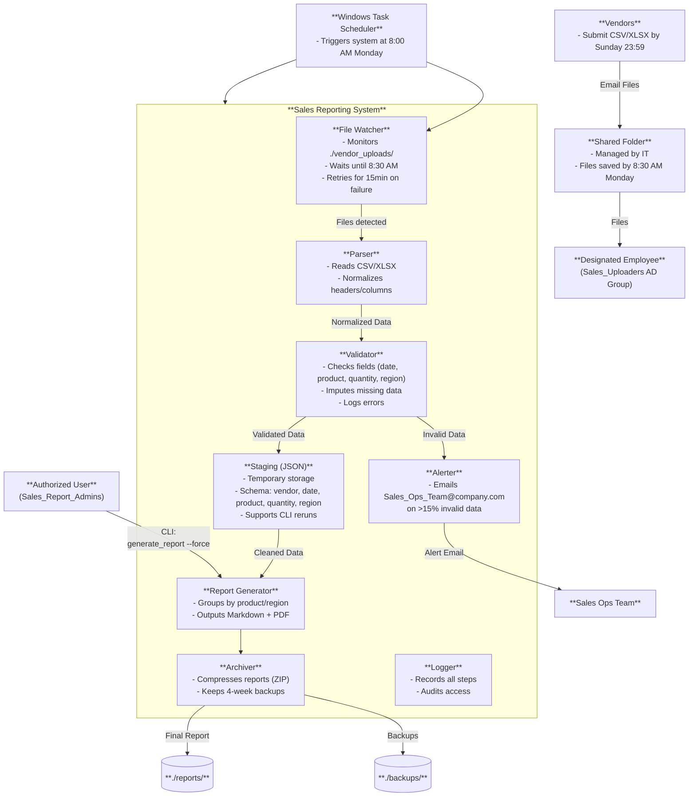

```mermaid
flowchart TD
    %% ===== External Systems/Actors =====
    Vendors["**Vendors**<br>- Submit CSV/XLSX by Sunday 23:59"] -->|Email Files| SharedFolder["**Shared Folder**<br>- Managed by IT<br>- Files saved by 8:30 AM Monday"]
    SharedFolder -->|Files| DesignatedEmployee["**Designated Employee**<br>(Sales_Uploaders AD Group)"]
    TaskScheduler["**Windows Task Scheduler**<br>- Triggers system at 8:00 AM Monday"] --> System

    %% ===== Core System Components =====
    subgraph System["**Sales Reporting System**"]
        direction TB
        FileWatcher["**File Watcher**<br>- Monitors ./vendor_uploads/<br>- Waits until 8:30 AM<br>- Retries for 15min on failure"]
        Parser["**Parser**<br>- Reads CSV/XLSX<br>- Normalizes headers/columns"]
        Validator["**Validator**<br>- Checks fields (date, product, quantity, region)<br>- Imputes missing data<br>- Logs errors"]
        Staging["**Staging (JSON)**<br>- Temporary storage<br>- Schema: vendor, date, product, quantity, region<br>- Supports CLI reruns"]
        Reporter["**Report Generator**<br>- Groups by product/region<br>- Outputs Markdown + PDF"]
        Archiver["**Archiver**<br>- Compresses reports (ZIP)<br>- Keeps 4-week backups"]
        Alerter["**Alerter**<br>- Emails Sales_Ops_Team@company.com<br>on >15% invalid data"]
        Logger["**Logger**<br>- Records all steps<br>- Audits access"]
    end

    %% ===== Data Flow =====
    TaskScheduler --> FileWatcher
    FileWatcher -->|"Files detected"| Parser
    Parser -->|"Normalized Data"| Validator
    Validator -->|"Validated Data"| Staging
    Validator -->|"Invalid Data"| Alerter
    Staging -->|"Cleaned Data"| Reporter
    Reporter --> Archiver
    Archiver -->|"Final Report"| ReportsFolder[("**./reports/**")]
    Archiver -->|"Backups"| BackupsFolder[("**./backups/**")]
    Alerter -->|"Alert Email"| SalesOpsTeam["**Sales Ops Team**"]

    %% ===== Manual Override =====
    AuthorizedUser["**Authorized User**<br>(Sales_Report_Admins)"] -->|"CLI:<br>generate_report --force"| Reporter
```