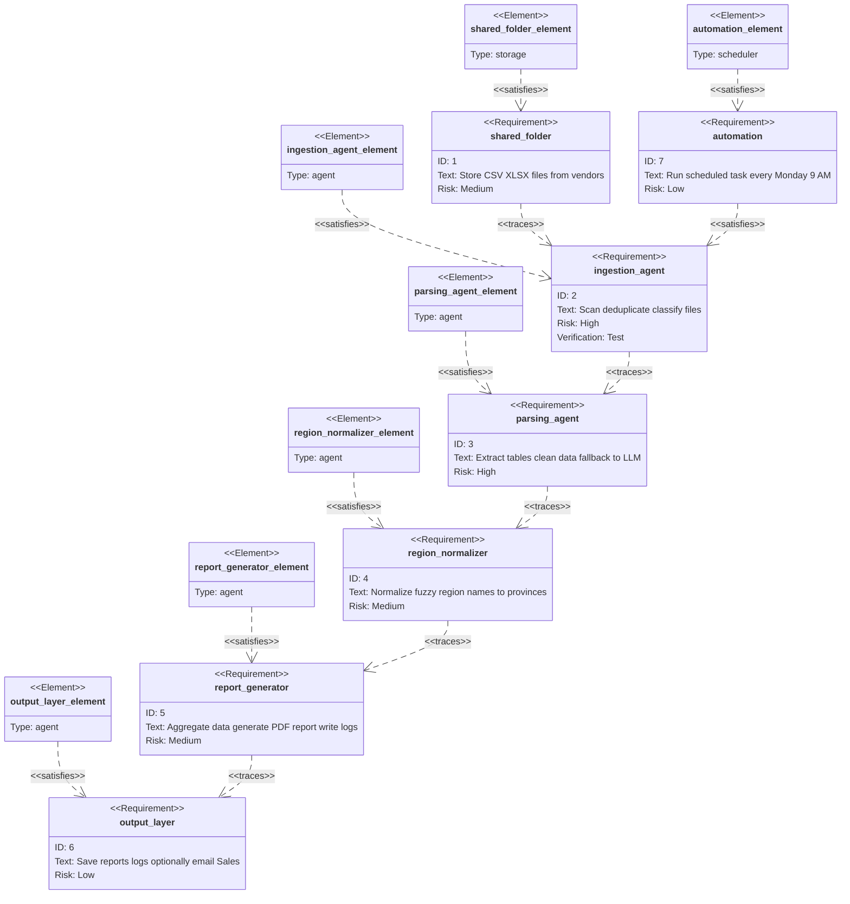

```mermaid
requirementDiagram
    requirement shared_folder {
        id: 1
        text: Store CSV XLSX files from vendors
        risk: medium
    }

    requirement ingestion_agent {
        id: 2
        text: Scan deduplicate classify files
        risk: high
        verifymethod: test
    }

    requirement parsing_agent {
        id: 3
        text: Extract tables clean data fallback to LLM
        risk: high
    }

    requirement region_normalizer {
        id: 4
        text: Normalize fuzzy region names to provinces
        risk: medium
    }

    requirement report_generator {
        id: 5
        text: Aggregate data generate PDF report write logs
        risk: medium
    }

    requirement output_layer {
        id: 6
        text: Save reports logs optionally email Sales
        risk: low
    }

    requirement automation {
        id: 7
        text: Run scheduled task every Monday 9 AM
        risk: low
    }

    element shared_folder_element {
        type: storage
    }

    element ingestion_agent_element {
        type: agent
    }

    element parsing_agent_element {
        type: agent
    }

    element region_normalizer_element {
        type: agent
    }

    element report_generator_element {
        type: agent
    }

    element output_layer_element {
        type: agent
    }

    element automation_element {
        type: scheduler
    }

    shared_folder_element - satisfies -> shared_folder
    ingestion_agent_element - satisfies -> ingestion_agent
    parsing_agent_element - satisfies -> parsing_agent
    region_normalizer_element - satisfies -> region_normalizer
    report_generator_element - satisfies -> report_generator
    output_layer_element - satisfies -> output_layer
    automation_element - satisfies -> automation

    shared_folder - traces  -> ingestion_agent
    ingestion_agent - traces  -> parsing_agent
    parsing_agent - traces  -> region_normalizer
    region_normalizer - traces  -> report_generator
    report_generator - traces  -> output_layer
    automation - satisfies -> ingestion_agent

```